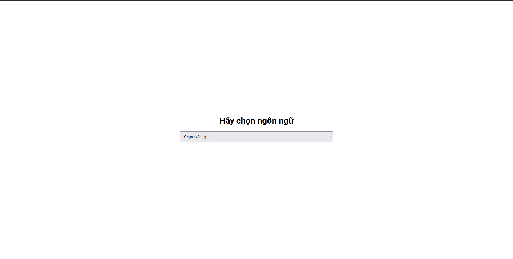
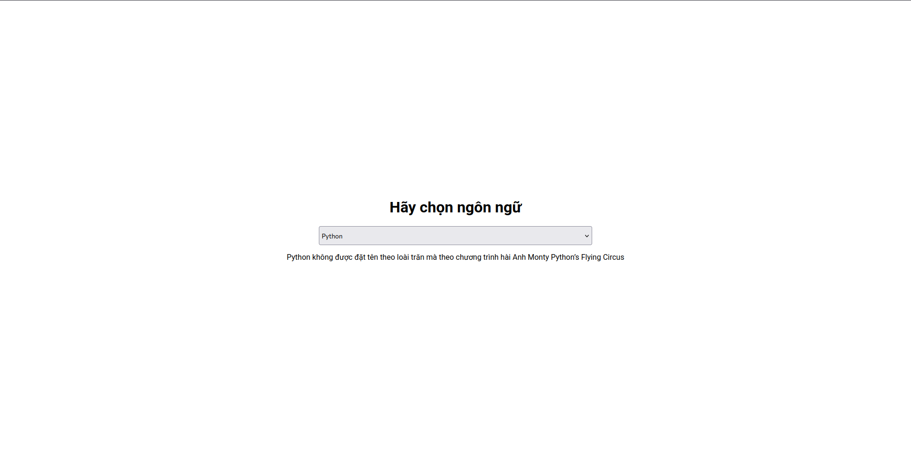

# Giới thiệu dự án Languages-Fact
## Tổng quan
Languages-Fact là một web chỉ có 1 trang duy nhất: Người dùng chọn 1 trong 10 ngôn ngữ có sẵn, hệ thống sẽ đưa ra 1 trong 5 sự thật ngẫu nhiên về ngôn ngữ đó

## Video demo


## Ảnh chụp giao diện
<figure>
    
    <figcaption>Trang chủ </figcaption>
</figure>
<figure>
    
    <figcaption>Trang chủ sau khi chọn 1 ngôn ngữ</figcaption>
</figure>

## Cách chạy dự án
Bước 1: Sử dụng 1 trong 2 lệnh git clone sau:
```bash
git clone https://github.com/pararhythm/Languages-Fact.git
```
hoặc
```bash
git clone git@github.com:pararhythm/Languages-Fact.git
```

Bước 2: Cài đặt Extension Live Server nếu chưa có


Bước 3: Mở project và bấm vào Go Live
